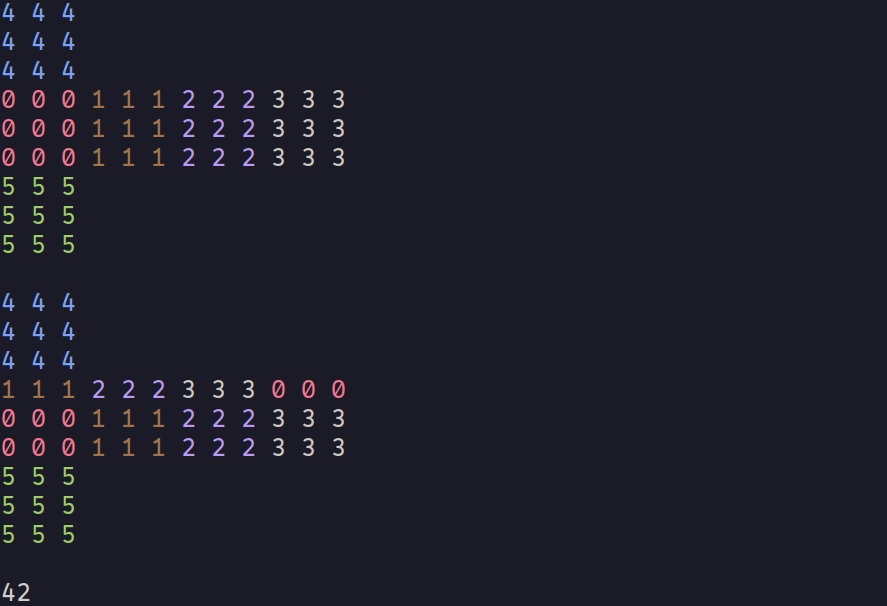

# minpycube
A minimal Python library for Rubik's Cube simulation with no dependencies.

## Installation
```bash
pip install minpycube
```

## Usage
```python
from minpycube import RCube

cb = RCube()
cb.print_colors()
cb.rotate("U")
cb.print_colors()
print(cb.calc_fit())
```
Example output:

