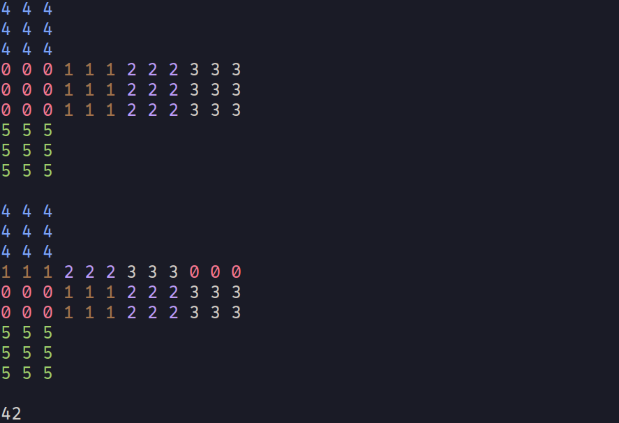

<div align="center">

# minpycube

**A minimal Python library for Rubik's Cube simulation with zero dependencies**

[](https://badge.fury.io/py/minpycube)
[](https://pypi.org/project/minpycube/)
[](https://opensource.org/licenses/MIT)
[](https://github.com/psf/black)

[Installation](#installation) •
[Quick Start](#quick-start) •
[Features](#features) •
[Documentation](#documentation) •
[License](#license)

</div>

---

## Features

✨ **Zero Dependencies** - Pure Python implementation with no external requirements
🎯 **Simple API** - Intuitive interface for cube manipulation
🎨 **Color Visualization** - ANSI-colored terminal output for easy debugging
⚡ **Fast Operations** - Efficient matrix-based representation
🔧 **Standard Notation** - Supports all 18 standard Rubik's Cube operations
📦 **Lightweight** - Minimal footprint, maximum functionality

## Installation

**Using uv (recommended):**
```bash
uv add minpycube
```

**Using pip:**
```bash
pip install minpycube
```

## Quick Start

```python
from minpycube import RCube

# Create a solved cube
cb = RCube()

# Visualize the cube
cb.print_colors()

# Perform a rotation (U = Up face clockwise)
cb.rotate("U")

# Check the result
cb.print_colors()

# Calculate fitness (54 = solved)
print(cb.calc_fit())
```

### Example Output



## Documentation

### Supported Operations

The library supports all standard Rubik's Cube notation:

| Operation | Description | Reverse |
|-----------|-------------|---------|
| `U` | Up face clockwise | `-U` |
| `D` | Down face clockwise | `-D` |
| `R` | Right face clockwise | `-R` |
| `L` | Left face clockwise | `-L` |
| `F` | Front face clockwise | `-F` |
| `B` | Back face clockwise | `-B` |
| `E` | Equatorial layer | `-E` |
| `M` | Middle layer | `-M` |
| `S` | Standing layer | `-S` |

### API Reference

#### `RCube()`
Creates a new solved Rubik's Cube instance.

#### `rotate(operation: str)`
Performs a rotation operation on the cube.

```python
cube.rotate("U")   # Single move
cube.rotate("-R")  # Reverse move
```

#### `print_colors()`
Displays the cube state with colored output in the terminal.

#### `calc_fit() -> int`
Returns the fitness value (0-54). A value of 54 indicates a solved cube.

#### `invert_op(operation: str) -> str`
Static method to get the inverse of an operation.

```python
RCube.invert_op("U")   # Returns "-U"
RCube.invert_op("-R")  # Returns "R"
```

## Development

### Setup

```bash
# Clone the repository
git clone https://github.com/mennymendoza/minpycube.git
cd minpycube

# Install development dependencies
uv sync
```

### Testing

```bash
# Run all tests
uv run pytest

# Run with coverage
uv run pytest --cov=minpycube
```

### Building

```bash
uv build
```

## Use Cases

- 🤖 Reinforcement learning environments
- 🧮 Algorithm development and testing
- 📊 Cube state analysis
- 🎓 Educational purposes
- 🔬 Research projects

## License

This project is licensed under the MIT License - see the [LICENSE](LICENSE) file for details.

## Contributing

Contributions are welcome! Please feel free to submit a Pull Request.

---

<div align="center">

**Made with ❤️ by [mennymendoza](https://github.com/mennymendoza)**

⭐ Star this repo if you find it useful!

</div>
